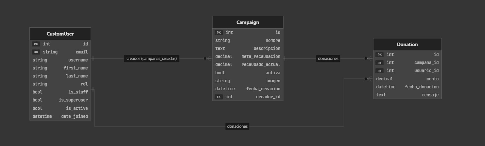
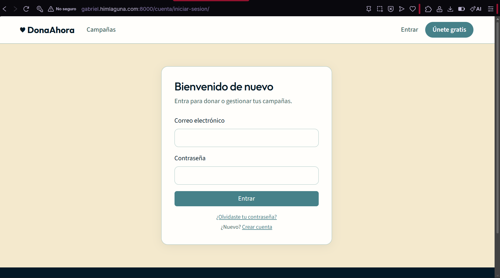
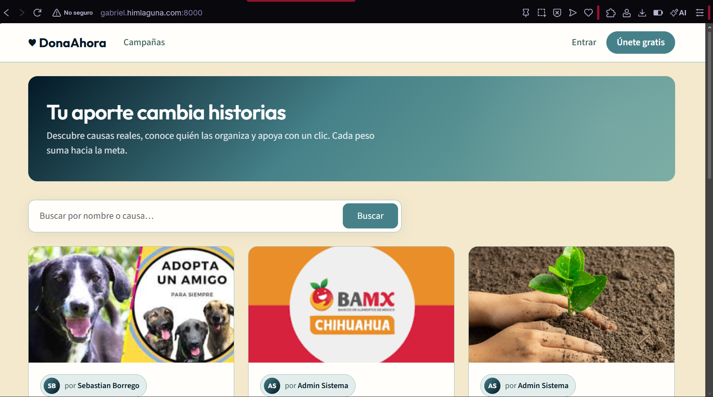
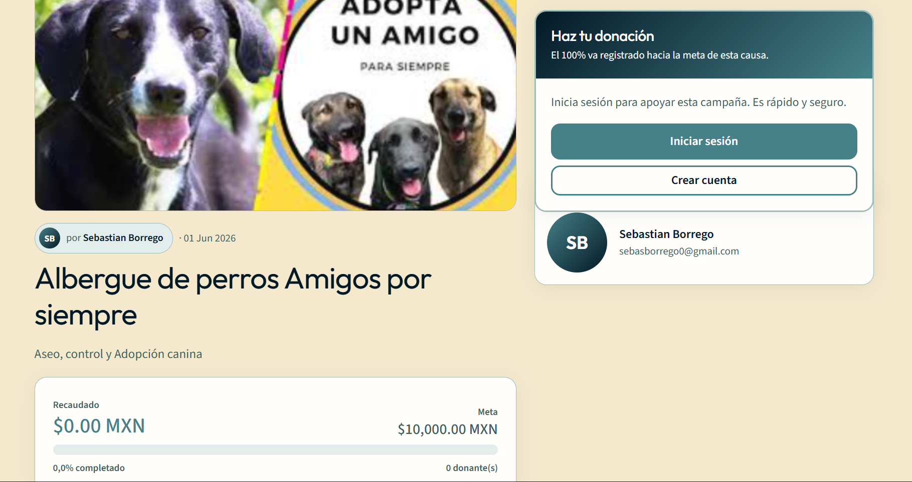

# Plataforma de Donaciones

Proyecto académico en **Django 5.x** y **Python 3.12** con **PostgreSQL**, **Docker** y despliegue preparado para **Oracle Cloud Infrastructure (OCI)**.

## Captura de pantalla



### CustomUser (Usuario personalizado)


### Campaign (Campaña)


### Donation (Donación)



## Credenciales de prueba

| Rol | Email | Contraseña |
|-----|-------|------------|
| Cuenta oficial / Admin | `sebasborrego1@gmail.com` | `Donaciones123` |
| Superusuario (prueba) | `admin@donaciones.com` | `admin123` |
| Usuario donante | `usuario@test.com` | `testpass123` |
| Creador (Gmail) | `sebasborrego0@gmail.com` | `testpass123` |
| Donante (correo ITL) | `alu.21130555@correo.itlalaguna.edu.mx` | `testpass123` |

Correos que reciben restablecimiento de contraseña si están registrados: los de esta tabla. El envío sale desde `sebasborrego1@gmail.com` (ver `.env`).

El admin puede crear/editar/eliminar campañas. El usuario normal puede registrarse, donar y ver **solo sus donaciones** en «Mis donaciones».

## Requisitos cumplidos (rúbrica)

- Django 5.x + Python 3.12 (Dockerfile `python:3.12-slim`)
- PostgreSQL (sin SQLite)
- Variables con `django-environ` (`SECRET_KEY`, `DEBUG`, `DATABASE_URL`, `EMAIL_*`)
- `CustomUser` con login por email
- Modelos `Campaign` y `Donation`
- CBV, URLs amigables, Bootstrap 5
- Autenticación completa (registro, login, logout, cambio y restablecimiento de contraseña)
- CRUD de campañas con permisos por rol (`donante`, `creador`, `admin`)
- Búsqueda de campañas + barra de progreso visual
- 5+ pruebas unitarias
- Docker Compose (`web` + `db`)

## Estructura

```
plataforma_donaciones/
├── apps/accounts/      # Usuario personalizado y autenticación
├── apps/campaigns/     # Campañas (CRUD)
├── apps/donations/     # Donaciones
├── django_project/     # settings, urls, wsgi
├── templates/          # base.html, account/, campaigns/, donations/
├── static/             # CSS
├── media/              # Imágenes de campañas
├── Dockerfile
└── docker-compose.yml
```

## Inicio rápido con Docker

```bash
cd plataforma_donaciones
cp .env.example .env
docker compose up --build
```

Abre: http://localhost:8000

## Desarrollo local (sin Docker)

```bash
python -m venv venv
venv\Scripts\activate   # Windows
pip install -r requirements.txt
cp .env.example .env
# Ajusta DATABASE_URL a tu PostgreSQL local
python manage.py migrate
python manage.py seed_users
python manage.py runserver
```

## Pruebas

```bash
docker compose exec web python manage.py test
```

## Correo Gmail (restablecer contraseña)

El sistema **siempre** muestra el mensaje en la consola del servidor y, si configuras Gmail en `.env`, también lo envía al correo del usuario (solo si ese email está registrado).

1. En Google: [Contraseñas de aplicación](https://myaccount.google.com/apppasswords) (requiere verificación en 2 pasos).
2. Crea una contraseña para «Correo» y cópiala (16 caracteres).
3. En tu archivo `.env`:

```env
EMAIL_BACKEND=django_project.email_backends.ConsoleAndGmailBackend
EMAIL_HOST=smtp.gmail.com
EMAIL_PORT=587
EMAIL_USE_TLS=True
EMAIL_HOST_USER=sebasborrego1@gmail.com
EMAIL_HOST_PASSWORD=contraseña-de-aplicacion-google
DEFAULT_FROM_EMAIL=sebasborrego1@gmail.com
```

4. Reinicia: `docker compose up --build`
5. Prueba en **Restablecer contraseña** con un email registrado (ej. `usuario@test.com`).

## Despliegue en OCI

1. Crea una instancia Compute (Ubuntu) con IP pública.
2. Instala Docker y Docker Compose.
3. Clona el repositorio y configura `.env` en producción:

```env
DEBUG=False
SERVE_MEDIA=True
SECRET_KEY=<clave-larga-aleatoria>
DATABASE_URL=postgres://usuario:clave@db:5432/donaciones
ALLOWED_HOSTS=tu-ip-publica,tu-dominio.com
CSRF_TRUSTED_ORIGINS=https://tu-dominio.com
EMAIL_BACKEND=django_project.email_backends.ConsoleAndGmailBackend
EMAIL_HOST=smtp.gmail.com
EMAIL_PORT=587
EMAIL_HOST_USER=tu-correo@gmail.com
EMAIL_HOST_PASSWORD=contraseña-de-aplicacion
DEFAULT_FROM_EMAIL=tu-correo@gmail.com
```

4. Abre el puerto **8000** (o 80 con proxy) en el Security List.
5. Ejecuta:

```bash
docker compose up -d --build
```

6. Accede desde el navegador: `http://<IP_PUBLICA>:8000`

### Imágenes que no se ven en OCI

Si subes fotos de campañas y no aparecen (404 en `/media/...`), suele ser porque en producción `DEBUG=False` y Django no servía archivos media. En `.env` de la instancia agrega:

```env
SERVE_MEDIA=True
```

Luego en el servidor Ubuntu:

```bash
cd plataforma_donaciones
git pull   # trae el fix si aún no lo tienes
docker compose down
docker compose up -d --build
mkdir -p media/campaigns
chmod -R 755 media
```


Si la subida falla por permisos: `sudo chown -R $USER:$USER media`

## Roles de usuario

| Rol | Permisos |
|-----|----------|
| `donante` | Donar, ver sus donaciones |
| `creador` | Crear y editar sus campañas |
| `admin` / `is_staff` | Todo + eliminar campañas |

Asigna el rol desde el panel `/admin/` o al crear usuarios.

## Comandos útiles

```bash
python manage.py seed_users      # Usuarios de prueba
python manage.py seed_campaigns  # Campañas de demostración
python manage.py test            # Pruebas unitarias
```

## Git

Historial con commits significativos: configuración inicial, datos demo, despliegue OCI, media y documentación.

## Autor
Gabriel Gerardo Cardenas Briones · 21130566
Roberto Carlos Ruacho Martinez · 21130555
Juan Raul Wong Aguilar · 21130564
Proyecto académico — Plataforma de Donaciones.

